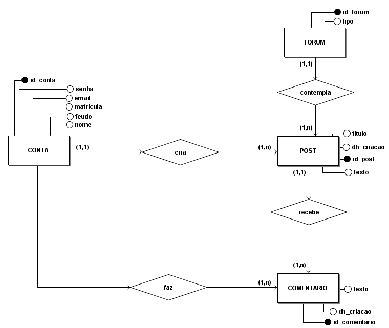
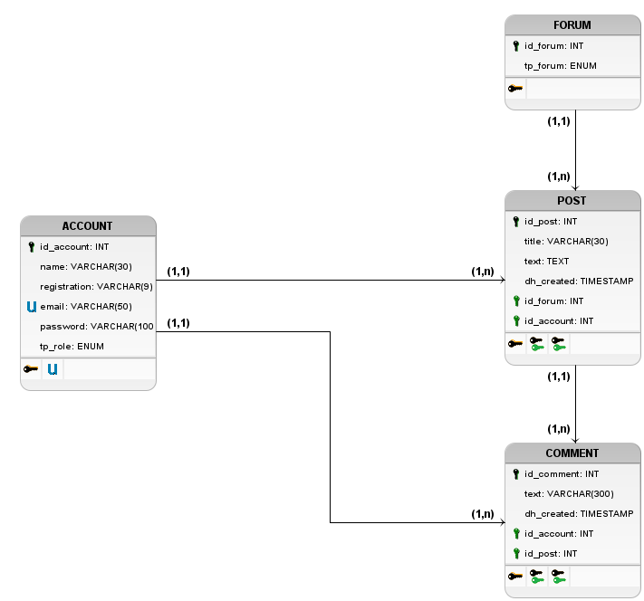

# Banco de dados
Como citado na sessão de [tecnologias](technologies.md#tecnologias), o banco de dados utilizado para o projeto foi o PostgreSQL, um SGBD (*Sistema Gerenciador de Banco de Dados*) relacional, que permite a criação de tabelas, relacionamentos, e a manipulação dos dados de forma simples e eficiente.

## Modelagem
Por se tratar de uma abordagem relacional, o banco de dados foi modelado seguindo o modelo entidade-relacionamento (MER) para representar as entidades e seus relacionamentos de forma a abstrair o funcionamento do sistema, facilitando assim a implementação do banco de dados e o entendimento do projeto por parte dos integrantes e possíveis *stakeholders*. 

Para isso, foi desenvolvido um diagrama entidade-relacionamento, um diagrama lógico de dados, e à partir deste, foi implementado um script DDL (*Data Definition Language*) para a criação das tabelas no banco de dados. Ambos os diagramas foram desenvolvidos utilizando a ferramenta [brModelo](http://www.sis4.com/brModelo/), que permite a criação de diagramas de banco de dados de forma simples e eficaz.

## Diagrama Entidade-Relacionamento
O diagrama entidade-relacionamento (DER) foi utilizado com o propósito de abstrair de maneira simples e de fácil compreensão as entidades, seus atributos e relacionamentos. O DER desenvolvido para o projeto pode ser visto abaixo:

## Diagrama Lógico de Dados
O diagrama lógico de dados (DLD) foi criado com o intuito de fornecer uma visão mais técnica e próxima da implementação do banco de dados, representando as tabelas, seus atributos, tipos de dados, e a representação real entre os relacionamentos. O DLD desenvolvido para o projeto pode ser visto abaixo:

## Scripts
O script DDL foi criado à partir do diagrama lógico de dados, e pode ser encontrado no [repositório](https://github.com/thiagolopess/DS-Blog-Azul-Hortencias-Back-End/tree/main/src/main/resources/database_scripts) destinado para o backend do projeto
