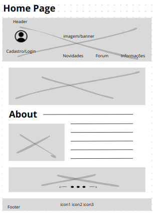
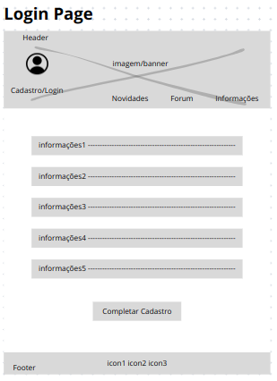
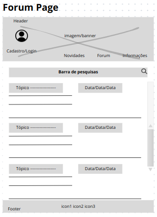
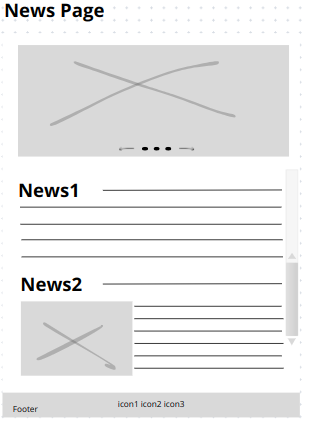
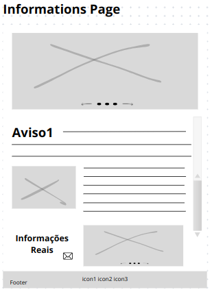
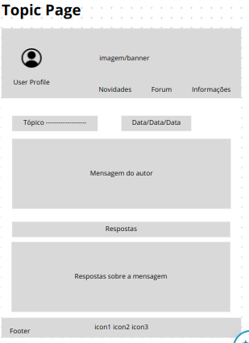
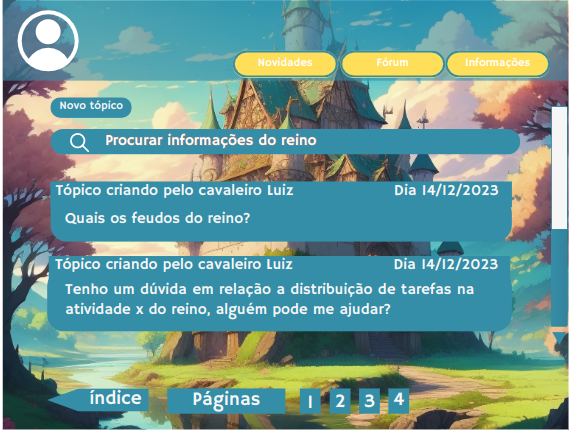

# Protótipos

## Introdução
A prototipação é parte fundamental no desenvolvimento de software, pois proporciona uma visão tangível do design antes da execução código. Essa representação visual antecipada simplifica a interpretação de requisitos, permitindo iterações ágeis e evitando equívocos durante o desenvolvimento, economizando tempo e diminuindo o retrabalho.

## Protótipo de Baixa Fidelidade
Foi feito um protótipo de baixa fidelidade para representar a interface do projeto de maneira clara e simples, com o intuito de oferecer uma visão geral sobre o front-end do projeto e suas funcionalidades. O protótipo teve como base o Rich Picture que a equipe elegeu para representar o projeto.

As seguintes telas foram contempladas:

- Home Page
- Login Page
- Forum Page    
- News Page
- Informations Page
- Topic Page

Essas telas possibilitam a execução das seguintes ações:

- Ações da tela inicial
- Criação de um usuário para login
- Realizar postagens
- Atualizar postagens
- Remover postagens
- Acesso a página de novidades
- Acesso a página de informações
- Acesso a página geral como novos tópicos

### Página Home

### Página de Login

### Página de Fórum

### Página de Notícias

### Página de Informações

### Topic Page

## Protótipo de alta fidelidade
O protótipo de alta fidelidade desenvolvido para a aplicação contempla uma maior riqueza de detalhes, com o intuito de representar de maneira mais fiel a interface do projeto. Nele, foi levado em consideração o protótipo de baixa fidelidade, porém com uma maior riqueza de detalhes, como cores, fontes, imagens e ícones que simbolizam de forma mais precisa o que será implementado no decorrer do projeto.

As seguintes telas foram contempladas:

- Home Page
- Login Page
- Password Reset Page
- Forum Page
- News Page
- Informations Page
- Topic Page

Essas telas possibilitam a execução das seguintes ações:

- Ações da tela inicial
- Criação de um usuário para login
- Recuperar a senha
- Realizar postagens
- Atualizar postagens
- Remover postagens
- Acesso a página de novidades
- Acesso a página de informações
- Acesso a página geral como novos tópicos

### Home Page

### Login Page

### Password Reset Page

### Forum Page

### News Page

### Topic Page

## Referências
[Interactive Design Foundation - Prototyping](https://www.interaction-design.org/literature/topics/prototyping#:~:text=Prototyping%20is%20an%20experimental%20process,can%20release%20the%20right%20products.)
