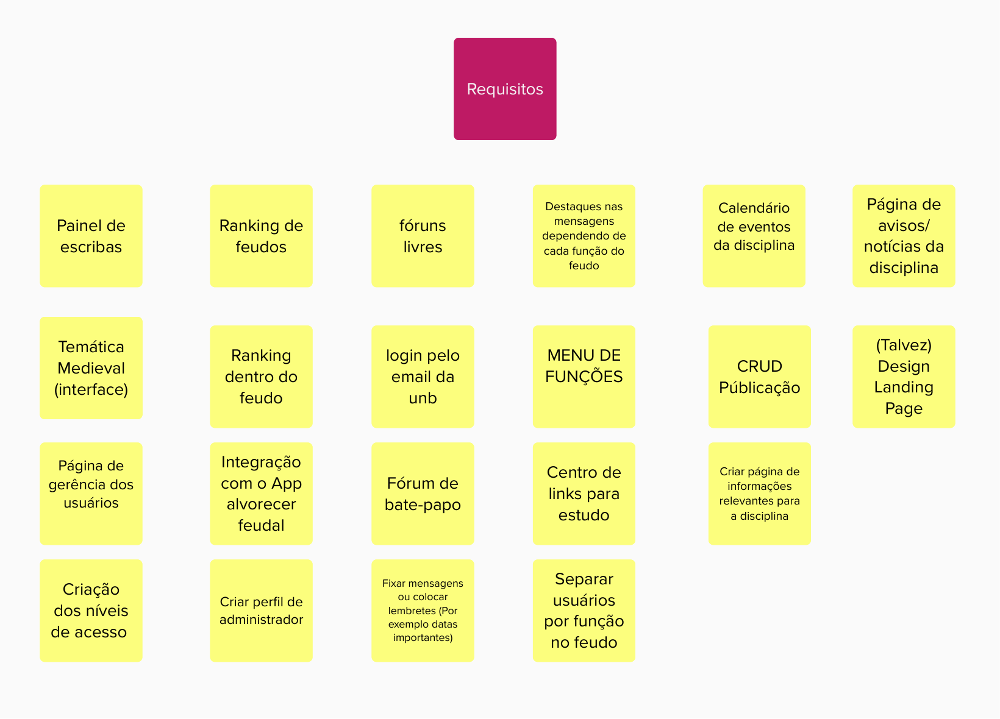
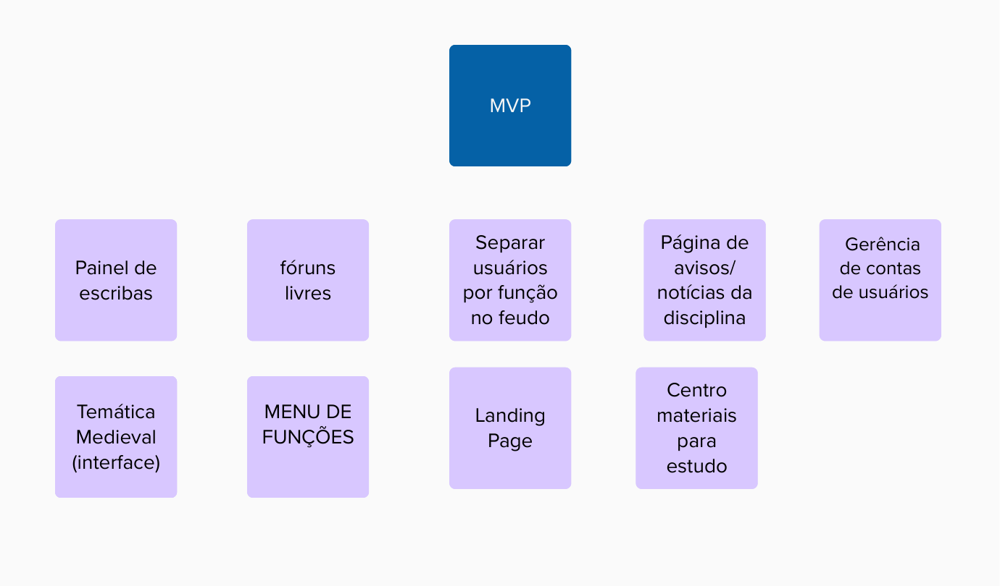

# Requisitos do Software

## Elicitação dos Requisitos
Para a elicitação dos requisitos, foi realizada a técnica de Brainstorming com todos os integrantes do grupo, afim de elicitar uma grande quantidade de possíveis requisitos para o software.

O resultado da elicitação pode ser encontrado abaixo:

## Priorização dos Requisitos - MVP
Após a elicitação, os requisitos foram priorizados levando em consideração o escopo, prazo e nível de importância para a aplicação, com o objetivo de se alcançar um MVP à partir dos requisitos previamente elicitados.

O resultado da priorização pode ser encontrado abaixo:

