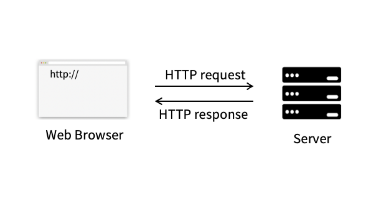
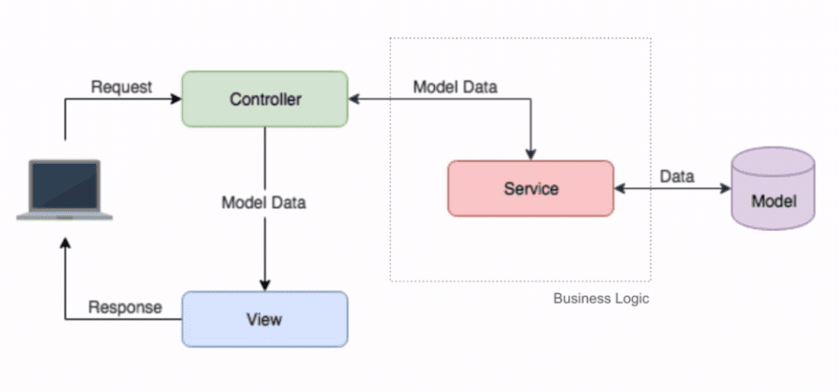
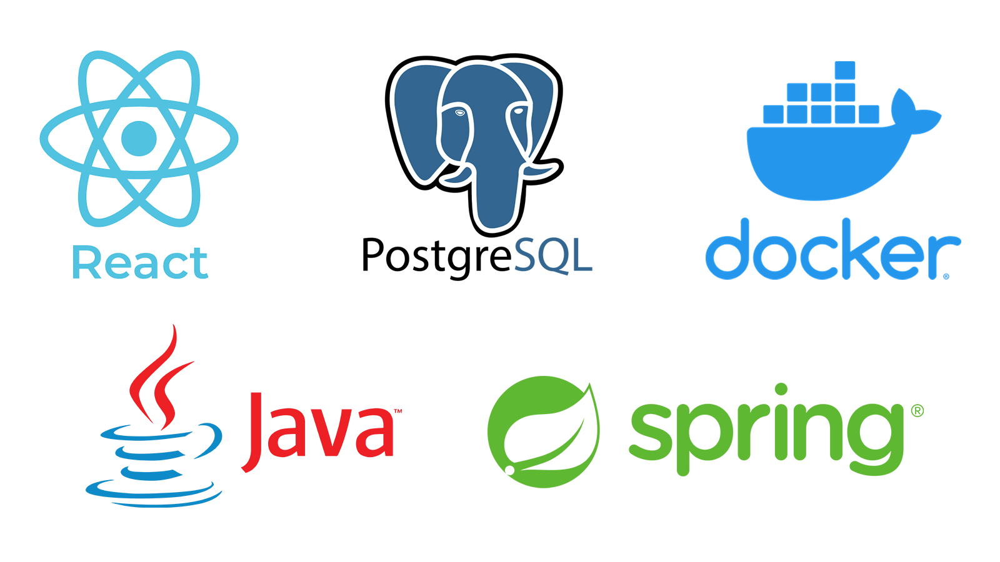

# Tecnologias

## Sobre a aplicação 

O projeto se trata de uma aplicação web, contando com um frontend, um backend, e um banco de dados. Será utilizada uma arquitetura cliente-servidor, onde os clientes farão a comunicação com o servidor (backend) através do frontend, seguindo o protocolo HTTP.

O backend seguirá uma abordagem advinda do padrão arquitetural MVC (*Model*, *View*, *Controller*), com o acréscimo da camada *Service*, que age como uma interface entre a *Controller* e a *Model*.

## Tecnologias utilizadas

### Frontend
Para o frontend, será utilizado o framework React, que é uma biblioteca JavaScript de código aberto com foco em criar interfaces de usuário em páginas web. O React é mantido pelo Facebook, Instagram e uma comunidade de desenvolvedores individuais e empresas, e conta com uma boa documentação, além de uma grande comunidade de desenvolvedores, e uma grande quantidade de bibliotecas e ferramentas que auxiliam no desenvolvimento de aplicações web.

### Backend
Para o backend, será utilizado o Java, em conjunto com o framework Spring, que é um framework que facilita a criação de aplicações web, fornecendo uma estrutura básica para o desenvolvimento, além de ferramentas que auxiliam na criação de aplicações web, e menos código boilerplate. O Spring é um framework amplamente utilizado no mercado, e possui uma grande comunidade de desenvolvedores, e também conta com uma grande quantidade de bibliotecas e ferramentas que ajudam no desenvolvimento de aplicações web.

### Banco de dados
Para o banco de dados, será utilizado o PostgreSQL, que é um sistema gerenciador de banco de dados objeto relacional, desenvolvido como projeto de código aberto. O PostgreSQL é um dos sistemas gerenciadores de banco de dados mais utilizados no mercado, contando com uma boa documentação e uma grande comunidade de desenvolvedores.

